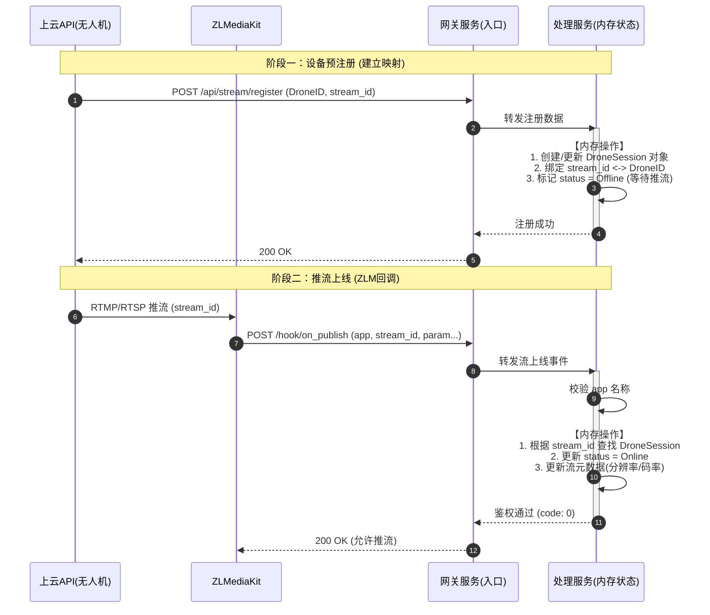
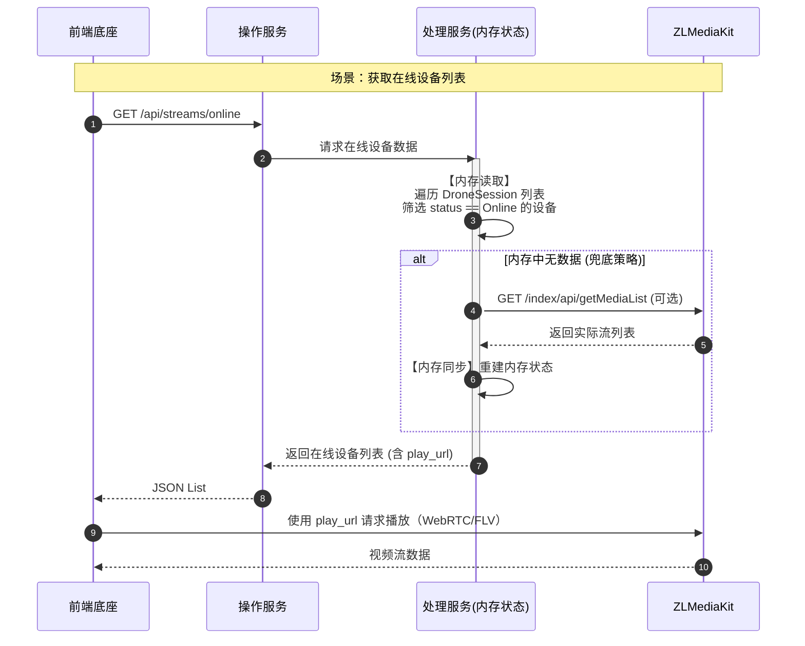
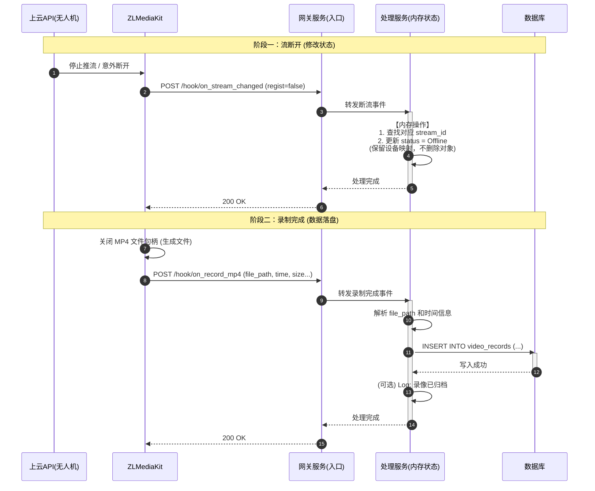
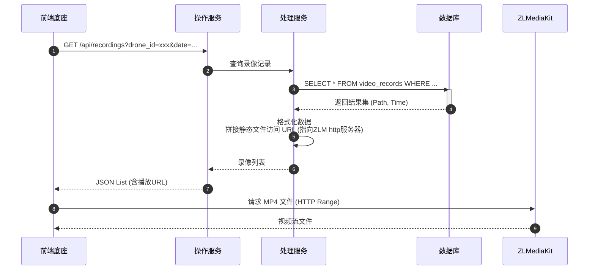

> ref: https://rcn29iascsr0.feishu.cn/wiki/UGxswf4UlifXrWkqIMicsVAEn2e?fromScene=spaceOverview
## API 开发
**后端服务需要实现的完整接口清单**，分为两类：**WebHook 接收接口（入站）** 和 **业务 API 接口（出站）**。

#### 1. WebHook (供 ZLM 调用)

| 路径 | 方法 | 必须性 | 用途 | 逻辑要点 |
| --- | --- | --- | --- | --- |
| `/hook/on_publish` | POST | **必须** | 流上线 | 校验 `app` 名，关联 `stream_id` 到无人机设备 |
| **`/hook/on_stream_changed`** | POST | **必须** | **流断开** | 判断 `regist=false`，将设备状态置为“离线” |
| `/hook/on_record_mp4` | POST | **必须** | 录制完成 | 接收 `file_path`，存入数据库 |

#### 2. 业务 API (供前端/上云网关调用)

| 路径 | 方法 | 用途 | 备注 |
| --- | --- | --- | --- |
| `/api/stream/register` | POST | 设备注册 | 接收 Drone ID，建立 `stream_id` 与设备的映射关系 (存 Redis， v0 先用进程内存) |
| `/api/streams/online` | GET | 在线列表 | **优先查 Redis 缓存(v0 先用进程内存)**，兜底查 ZLM API (减少对 ZLM 的 HTTP 请求压力) |
| `/api/recordings` | GET | 录像列表 | 查数据库 |

## 存储设计

### 1. 内存存储（极速响应 / 易失性数据）

**对象：** 设备状态、直播元数据。

* **存储内容：** * **设备映射：** `stream_id` 与无人机 SN、名称、机型信息的绑定关系。
* **实时状态：** 当前是否正在推流（Online/Offline）。
* **实时参数：** ZLM 在线流的分辨率、码率、帧率。

* **数据来源：** `/api/stream/register`（预注册）、`on_publish`（上线）、`on_stream_changed`（下线）。
* **特点：** 读写极快，服务重启即重置（可通过重新拉取 ZLM 列表恢复部分状态）。
> 后期用中间间 缓存 信息
---

### 2. 数据库存储（持久化 / 资产数据）

**对象：** 录像文件记录（唯一需要落盘的表）。

* **存储内容（1 张表）：**
* `stream_id`：标识属于哪台飞机。
* `file_path / url`：视频文件的物理路径与 HTTP 播放地址。
* `time_info`：开始时间、结束时间、视频时长。
* `file_meta`：分辨率、文件大小。

* **数据来源：** `on_record_mp4`（录制完成回调）。
* **特点：** 保证服务重启后，历史回放记录不丢失。

---

### 3. 文件系统存储（流媒体原始数据）

**对象：** MP4 录像文件。

* **存储路径：** 由 ZLMediaKit 指定的磁盘路径。
* **管理方式：** 后端数据库只记录其“路径索引”，不存储二进制内容。

##  时序图

### 核心实体说明
*   **无人机/上云API**: 视频源端。
*   **ZLMediaKit**: 流媒体服务器（核心），负责推流、分发、录制。
*   **网关服务 (原入口服务)**: 负责接收 ZLM 的 WebHook 和无人机的注册请求。
*   **处理服务**: 业务逻辑核心，维护**内存状态**。
*   **操作服务**: 面向前端的 API 接口层。
*   **数据库**: 仅存储录像文件记录。
*   **前端底座**: 用户界面。

---

### 1. 设备注册与推流上线流程 (Device Register & Go Live)

此流程描述设备如何告知后端它的存在，以及 ZLM 如何通知后端流已上线。

*   **内存变化**: 建立 `stream_id` 到 `DroneInfo` 的映射，更新流状态为 `Online`。
*   **数据库变化**: 无。

---

### 2. 前端获取直播地址与观看流程 (Live Playback)

此流程描述前端如何查询在线设备并获取播放地址。

*   **内存变化**: 读取在线列表，读取流状态。
*   **数据库变化**: 无。
*   **兜底策略**: 如果内存中查不到流信息，尝试调用 ZLM API 确认（可选）。

---

### 3. 断流与录像归档流程 (Stream End & Archiving)

这是最关键的流程，涉及状态清理和数据持久化。

*   **内存变化**: 更新流状态为 `Offline`。
*   **数据库变化**: **新增**一条录像记录（文件路径、时长等）。

---

### 4. 历史录像回放流程 (History Playback)

此流程完全依赖数据库，不涉及内存中的实时状态。

*   **内存变化**: 无。
*   **数据库变化**: 读取录像记录。

